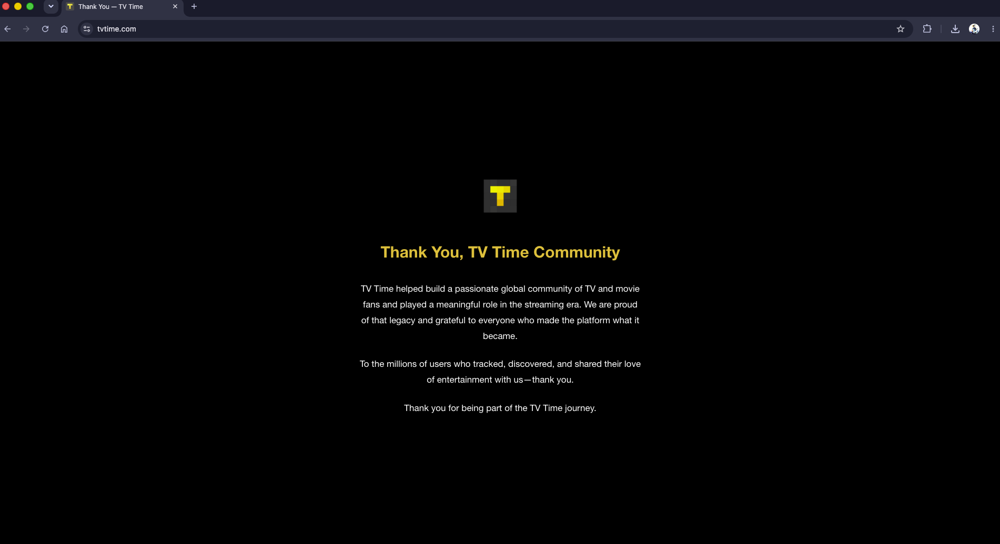
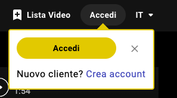

# Why This Project Exists

## The TV Time shutdown

For years, TV Time was, for many people, the best tracker on the market. Then one day its website stopped being an app and became a goodbye page:

> Thank You, TV Time Community
>
> TV Time helped build a passionate global community of TV and movie fans and played a meaningful role in the streaming era. [...] To the millions of users who tracked, discovered, and shared their love of entertainment with us: thank you.

According to founder Antonio Pinto's own account of the project, TV Time started in 2011 as a small side project (TVShow Time), grew to 1.5M users almost entirely through word of mouth, was acquired in 2016, renamed, and grew further to 2.5M active users. It ran for over a decade before the servers that hosted millions of people's watch history became too expensive to keep alive.

None of that history was a technical failure. It was a business outcome. And every user's tracking history (years of episodes, ratings, notes, watch dates) depended entirely on that business continuing to exist.

That is the actual problem this project exists to solve. Not "TV Time was bad." TV Time was, by most accounts, good. The problem is that a tracker tied your personal history to a company's balance sheet, and nobody who used it had a way to see that risk coming, or a way out of it that didn't mean losing the history itself.

## What happened next made the point for us

When TV Time closed, its users didn't just lose an app, they went looking for a replacement, all at once. What followed is a pretty good demonstration of why "just switch to another tracker" doesn't actually solve the underlying issue.

Community reports around Refract, one of the trackers that absorbed a wave of TV Time refugees, describe exactly the failure mode you'd expect from a sudden migration into another centralized, account-based service: import queues backed up for days, servers struggling under load, inconsistent import formats, and features breaking under demand. "I've been in the queue for more than three days to import my data from TV Time," as one user put it. Another: "Give it a few days [...] a big number of new Users also means a big community in the end," which is true, and also exactly the tradeoff this project is trying to avoid asking anyone to accept.

Antonio Pinto, TV Time's original founder, built a spiritual successor called Bingers, explicitly re-engineered so hosting costs wouldn't repeat the failure that killed TV Time. That's a real, honest fix to a real problem (server costs) and worth respecting. But it's still the same underlying model: an account, a company, and a server that has to keep running forever for your history to stay available. Bingers may well succeed at staying sustainable. The point isn't that it will fail. The point is that your personal history still shouldn't need to bet on that.

## The rest of the landscape has the same shape

Since TV Time closed, people have tried a long list of alternatives: Trakt, Simkl, Showly, Refract, Serializd, Sofa Time, JustWatch, Cinexplore, BingeBoxd, Next Episode, Bingers, and others. Every one of them has a different set of tradeoffs: some are congested, some are platform-limited (iOS-only, no desktop web), some have UIs people don't like, some are actively developed and well loved.

But look past the differences and almost all of them share the same foundational assumption: your watch history lives on their servers, behind their account system, and it exists for as long as their company decides to keep it running. Whether that's funded by ads, a subscription, or genuine goodwill doesn't change the shape of the risk, it just changes how long you have before it might matter.

That's not a criticism of any single one of these products. Several of them are genuinely well built. It's an observation that the entire category has converged on the same architecture, and that architecture has a single point of failure built into it by design: **you**, the account holder, are the one thing that can't survive the company disappearing, even though you're the only party in the relationship who didn't choose to take that risk.

## What this project does differently

open-personal-tracking starts from the opposite assumption:

> The application may disappear. Your history must not.

Concretely, that means:

- No account required to use the core product.
- The local device is the source of truth, not a server.
- Full export, always, in a documented format: not a feature that can be paywalled or removed.
- Metadata providers (TMDB, TheTVDB, Open Library, AniList, and others) enrich your items, but if any of them disappears, your data still works.
- Network features (comments, public lists, recommendations) are optional, and the core app must keep working without them.

If this project shut down tomorrow, the honest goal is that nobody using it would need to scramble, wait in an import queue, or lose a single rating, note, or watch date. That's the bar. Everything else in this repository exists in service of it.
